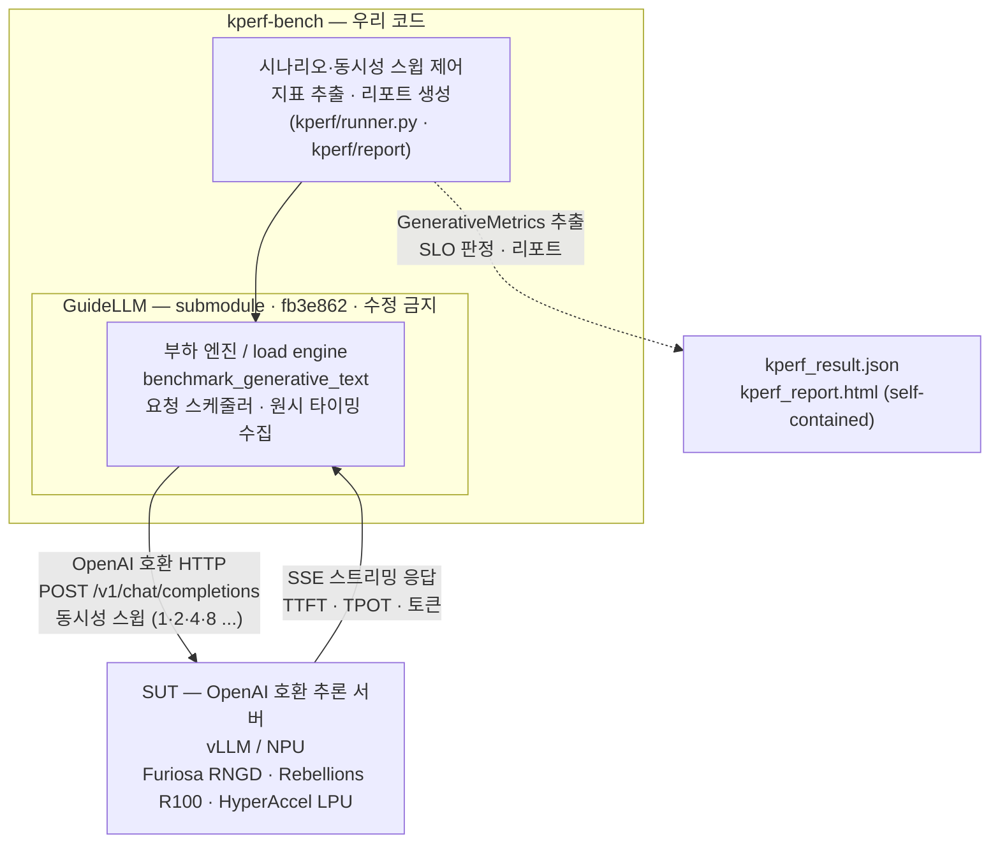

# K-Perf Reference Benchmark (kperf-bench)

> 국산 AI반도체(NPU) 성능 인증을 위한 **참조 벤치마크** — [GuideLLM](https://github.com/vllm-project/guidellm)을
> 감싸 OpenAI 호환 추론 서버(SUT)에 부하를 걸고 **K-Perf 지표를 측정·기록**한다.
>
> 한국정보통신기술협회(TTA)의 K-Perf 성능 인증 체계를 위한 재현 가능한 측정 도구.

---

## 아키텍처 한눈에 보기

`kperf-bench`(우리 코드)가 부하 엔진인 **GuideLLM을 그대로 감싸(import)** SUT에 부하를 주고,
응답 타이밍을 받아 K-Perf 지표로 가공한다.



> `kperf-bench` 박스 **안에** GuideLLM 박스가 들어 있는 것이 핵심 — GuideLLM은 부하를 만드는 엔진이고,
> kperf는 그 위에 **K-Perf 측정 체계(지표·SLO·리포트)를 입히는 래퍼**다.

---

## 동작 메커니즘

1. **시나리오 정의** — kperf가 ISL/OSL(입·출력 토큰 길이)과 동시성 스윕(예: 1·2·4·8)을 설정한다.
2. **부하 발생** — 내장한 GuideLLM(수정 없이 `import`)이 그 설정대로 SUT에 동시 요청을 발생시킨다.
3. **응답 수집** — SUT(OpenAI 호환 서버)가 **SSE 스트리밍**으로 응답하고, GuideLLM이 요청별 원시 타이밍을 수집한다.
4. **지표 추출** — kperf가 GuideLLM의 `GenerativeMetrics`에서 **K-Perf 지표**(TTFT / TPOT / E2EL / Throughput,
   각 P50·P90·P99)를 꺼낸다.
5. **판정·리포트** — kperf가 **SLO 등급**(TTFT P90 ≤ 2000ms 그리고 TPOT P90 ≤ 30·40·50ms)을 매기고,
   **인터랙티브 HTML 리포트**(동시성 슬라이더 + 곡선/시그니처 차트)를 생성한다.

> 요약: **GuideLLM = 부하 엔진**, **kperf = K-Perf 측정 체계를 입히는 래퍼.**

---

## 저장소 구조

```text
KPerf_TTA/
├─ kperf/                     # 우리 코드 (수정 대상)
│  ├─ runner.py               # 진입점: 스윕 실행 · 지표 추출 (python -m kperf.runner [sweep])
│  └─ report/                 # 외부 의존 없는 self-contained HTML 리포트 생성기
│     ├─ html.py              #   인라인 SVG 차트 + 동시성 슬라이더 (CDN/JS 라이브러리 없음)
│     └─ assets/              #   TTA 로고/심볼 (리포트에 base64로 인라인)
├─ external/
│  └─ guidellm/               # submodule · fb3e862 고정 · 읽기 전용(절대 수정 금지)
├─ analysis/                  # GuideLLM 정적 분석 산출물 (01_scan, 02_code_map)
├─ spike/                     # 1회성 실험 코드
├─ docs/                      # 문서
├─ tests/
└─ pyproject.toml             # 패키지명 kperf · 런타임 deps 최소(guidellm은 submodule editable 설치)
```

---

## 빠른 시작 (Quickstart)

```bash
# 1) submodule 포함하여 클론 (이미 클론했다면 두 번째 줄로 초기화)
git clone --recurse-submodules https://github.com/ByoungjunSeo/KPerf_TTA.git
cd KPerf_TTA
# git submodule update --init --recursive   # (--recurse-submodules 없이 클론한 경우)

# 2) 가상환경
python -m venv .venv
source .venv/bin/activate

# 3) 설치 — GuideLLM(submodule)을 editable로 먼저, 그다음 kperf
pip install -e ./external/guidellm
pip install -e .

# 4) 구조 점검 (네트워크/부하 없음) — 시그니처·필드만 출력
python -m kperf.runner

# 5) 부하 측정 — OpenAI 호환 서버(vLLM 등)를 http://localhost:8000 에 먼저 기동한 뒤:
python -m kperf.runner sweep
```

* `python -m kperf.runner` (인자 없음) → `check()`: GuideLLM 공개 심볼의 시그니처/필드를 출력(부하 없음).
* `python -m kperf.runner sweep` → `run_sweep()`: 기본값으로 **동시성 스윕 `[1, 2, 4, 8]`**,
  단계당 `max_seconds=10`, target `http://localhost:8000`, 모델은 `/v1/models`에서 자동 취득.

### 결과물

| 파일 | 내용 |
|---|---|
| `kperf_result.json` | 동시성 단계별 K-Perf 지표(`list[dict]`) — 리포트 생성기의 입력 |
| `kperf_report.html` | 외부 의존 없는 self-contained 인터랙티브 리포트(동시성 슬라이더·차트·SLO·로고 인라인) |

---

## 핵심 원칙

* **GuideLLM은 수정하지 않는다.** `external/guidellm`은 submodule로 `fb3e862`에 **고정**하고 `import`만 한다 — 재현성 보장.
* **측정 안 한 값은 만들지 않는다.** 전력·가격(전성비/가성비) 등 미측정 항목은 리포트에서 **빈 패널 + "미측정"**으로 남긴다.
  단일 동시성 측정이면 추세선/보간 없이 **측정점 1개만** 정직하게 표시한다.
* **폐쇄망 대비.** 리포트는 외부 CDN/JS/폰트/이미지 URL 없이 **self-contained HTML**(인라인 SVG·JS, 로고는 base64)로 생성한다.

---

## 라이선스

Apache-2.0 (`pyproject.toml` 참조). GuideLLM은 해당 프로젝트의 라이선스를 따른다(submodule).
